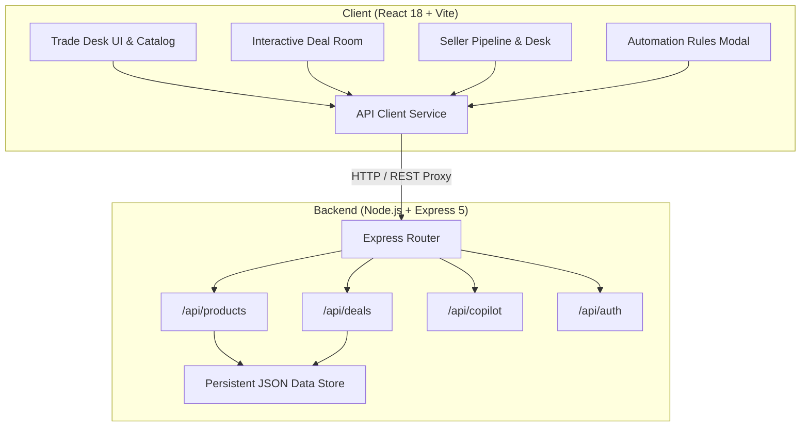

# ⚡ SellX — B2B Digital Trade Desk & Real-Time Negotiation Platform

[](https://reactjs.org/)
[](https://vitejs.dev/)
[](https://expressjs.com/)
[](https://tailwindcss.com/)
[](LICENSE)

**SellX** is an enterprise-grade B2B trade desk and real-time deal room where buyers and enterprise suppliers negotiate custom prices, volume tiers, lead times, and payment terms seamlessly. Designed with margin protection, rule-based auto-negotiation, and AI copilot guidance, SellX replaces slow back-and-forth emails with an interactive, transparent trading experience.

---

## 🌟 Key Features

### 🏢 1. Interactive Deal Room & Live Counteroffers
- **Structured Offer Exchange**: Submit, review, and negotiate critical terms in real time:
  - Unit Price & Volume Discounts (INR / Custom Currencies)
  - Lead Times & Milestone Delivery Schedules
  - Payment Terms (Advance, Net 30/60/90, Escrow Milestones)
  - Custom Freight & Inspection Clauses
- **Audit-Trail Chat & Offer Cards**: Every counter-proposal is version-controlled with visual diffs and status trackers.
- **Safety Confirmations**: Multi-step verification modals prevent accidental concessions or premature deal closures.

### 📊 2. Seller Desk & Margin Protection Pipeline
- **Live Deal Pipeline**: Track deals across negotiation stages (`Draft`, `Under Review`, `Counter Sent`, `Accepted`, `Escrow Pending`, `Settled`).
- **Margin Safeguards**: Visual indicators alert sellers when proposals approach or breach cost floor thresholds.
- **Bulk Product Inventory**: Manage catalog pricing, minimum order quantities (MOQs), and stock availability.

### 🤖 3. Smart Automation Engine & Simulator
- **Rule-Based Auto-Negotiation**: Configure automated acceptance thresholds and counteroffer behaviors per product.
- **Margin Protection Rules**: Reject or escalate offers below floor margins automatically.
- **Rule Simulator**: Test proposed rules against custom test offer prices and delivery timelines before deploying live.

### 🧠 4. AI-Powered Negotiation Copilot
- **Buyer Copilot**: Suggests strategic concession moves, benchmark comparisons, and optimal bundle offers.
- **Seller Copilot**: Analyzes buyer price elasticity, recommends profit-maximizing counter-steps, and monitors inventory velocity.

### 💳 5. Payment & Settlement Workflow
- Integrated milestone payment simulation with escrow protection.
- Downloadable purchase orders (PO), deal summaries, and transaction confirmations.

---

## 🏗️ System Architecture



---

## 🛠️ Tech Stack

| Domain | Technology |
| :--- | :--- |
| **Frontend Framework** | [React 18](https://reactjs.org/) with Hooks & Context |
| **Build Tool & Dev Server** | [Vite 5](https://vitejs.dev/) with hot module replacement (HMR) |
| **Styling** | [TailwindCSS v4](https://tailwindcss.com/) + Custom CSS Design System |
| **Icons** | [Lucide React](https://lucide.dev/) |
| **Backend API** | [Express 5](https://expressjs.com/) on [Node.js](https://nodejs.org/) |
| **Data Persistence** | File-backed JSON database with synchronous atomic sync & fallback |
| **Concurrency** | [Concurrently](https://www.npmjs.com/package/concurrently) for single-command full-stack development |

---

## 📁 Repository Structure

```text
sellx-app/
├── server/                    # Backend Express Application
│   ├── data_storage/          # Persistent local JSON database storage
│   │   └── db.json
│   ├── src/
│   │   ├── config/            # Environment & database initialization
│   │   ├── middleware/        # Request loggers & global error handlers
│   │   ├── routes/            # REST API endpoints (products, deals, copilot, auth)
│   │   ├── seed/              # Initial seed datasets (catalog & sample deals)
│   │   └── utils/             # Logger and helper functions
│   └── index.js               # Backend entry point
├── src/                       # Frontend React Application
│   ├── components/
│   │   ├── catalog/           # Product cards, catalog grid & detail pages
│   │   ├── dealroom/          # Live deal room, counteroffers, chat stream
│   │   ├── layout/            # Navigation header, footer, drawers (cart, notifs)
│   │   ├── modals/            # Acceptance, decline, payment, & RFQ modals
│   │   ├── pages/             # Informational pages & terms
│   │   └── seller/            # Seller desk, pipeline boards & auth screens
│   ├── data/                  # Static constants, product defaults, & deal stages
│   ├── services/              # Axios / Fetch API client layer
│   ├── utils/                 # Formatting (INR / dates), ID generators, styles
│   ├── NegotiationPlatform.jsx# Master platform shell & orchestration
│   └── main.jsx               # React DOM entry
├── package.json               # NPM scripts & dependencies
└── vite.config.js             # Vite configuration with backend proxy
```

---

## 🚀 Getting Started

### Prerequisites
- **Node.js**: v18.0.0 or higher
- **npm**: v9.0.0 or higher

### 1. Clone the Repository
```bash
git clone https://github.com/Abhi13shek/SellX.git
cd SellX
```

### 2. Install Dependencies
```bash
npm install
```

### 3. Run Development Server
Start both the Express API and Vite frontend concurrently:
```bash
npm run dev
```

The application will be accessible at:
- **Frontend App**: [http://localhost:5174](http://localhost:5174) (or `http://localhost:5173`)
- **Backend API**: [http://localhost:5001](http://localhost:5001)
- **API Health Check**: [http://localhost:5001/health](http://localhost:5001/health)

### Running Services Separately (Optional)
```bash
# Start backend server only
npm run server

# Start frontend client only
npm run client

# Create production build
npm run build
```

---

## 📡 REST API Reference

### Products
| Method | Endpoint | Description |
| :--- | :--- | :--- |
| `GET` | `/api/products` | Retrieve all products (supports `?category=`, `?search=`, `?sortBy=`) |
| `GET` | `/api/products/:id` | Get detailed product profile & pricing rules |
| `POST` | `/api/products` | Add a new product to the catalog |
| `PUT` | `/api/products/:id/automation` | Update automation rules for a product |
| `POST` | `/api/products/:id/automation/simulate` | Simulate auto-negotiation outcome against a test proposal |

### Deals & Negotiations
| Method | Endpoint | Description |
| :--- | :--- | :--- |
| `GET` | `/api/deals` | List all active deals with stage and actor metadata |
| `GET` | `/api/deals/:id` | Retrieve full deal history, offers, and chat trail |
| `POST` | `/api/deals` | Initiate a new deal room from an RFQ |
| `POST` | `/api/deals/:id/counter` | Submit a counteroffer (unit price, lead time, notes) |
| `POST` | `/api/deals/:id/accept` | Formally accept the latest active offer |
| `POST` | `/api/deals/:id/decline` | Decline negotiation with optional reason |
| `POST` | `/api/deals/:id/messages` | Append a message or system notification to deal room |

### Copilot & Analytics
| Method | Endpoint | Description |
| :--- | :--- | :--- |
| `GET` | `/api/copilot/buyer/:dealId` | Fetch strategic negotiation advice for the buyer |
| `GET` | `/api/copilot/seller/:dealId` | Fetch margin analysis & counter recommendations for seller |
| `GET` | `/api/stats` | Overall platform metrics, GMV, and active deal count |

---

## 💡 Role Switching & Demo Guide

SellX includes a built-in persona toggle in the top header:
1. **Buyer Persona**: Browse catalog items, submit customized RFQs, compare specs, and counter seller terms inside the Deal Room.
2. **Seller Persona**: Access the Seller Desk, monitor deal pipelines, configure automated rules, review margins, and simulate rule triggers.

---

## 🤝 Contributing

Contributions, issues, and feature requests are welcome!
1. Fork the project
2. Create your feature branch (`git checkout -b feature/AmazingFeature`)
3. Commit your changes (`git commit -m 'Add some AmazingFeature'`)
4. Push to the branch (`git push origin feature/AmazingFeature`)
5. Open a Pull Request

---

## 📄 License

This project is licensed under the MIT License — see the [LICENSE](LICENSE) file for details.
